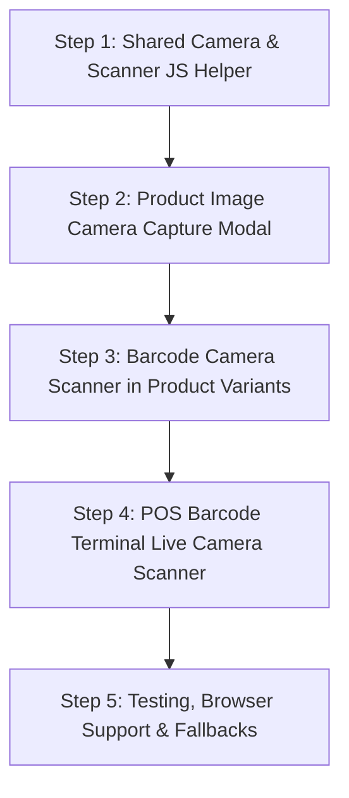

# Implementation Plan: Camera Product Image Capture & Accurate Camera Barcode Scanning

This plan outlines the architecture, user interface design, technology stack, and step-by-step implementation roadmap for adding:
1. **Direct Camera Image Capture** for Product & Variant catalog management.
2. **Accurate Camera Barcode Scanning** for POS quick billing terminal and barcode assignment.

---

## 1. Executive Summary & Goals

- **Direct Camera Product Photo Capture**: Eliminate the need to take a photo on a separate phone, transfer it, and upload it. Staff can capture product images directly from a laptop webcam, mobile phone, or tablet camera when adding or editing products.
- **High-Accuracy Camera Barcode Scanning**: Turn any device with a camera (mobile phone, tablet, desktop webcam) into an instant barcode reader. Works seamlessly alongside existing physical USB hand-held barcode guns.

---

## 2. Technology Stack & Technical Approach

### 2.1 Web Camera Access API
- Use native `navigator.mediaDevices.getUserMedia()` for hardware-accelerated video streaming.
- Support `facingMode: { exact: "environment" }` (rear camera) for mobile phones & tablets with fallback to default/user camera for laptops.

### 2.2 Barcode Recognition Library
- **Primary Scanner Engine**: Integrated **`html5-qrcode`** library (or `ZXing-js`) loaded via local vendor/CDN.
- **Supported Barcode Formats**:
  - 1D Product Barcodes: `EAN-13`, `EAN-8`, `UPC-A`, `UPC-E`, `CODE_128`, `CODE_39`, `ITF`, `CODABAR`
  - 2D Barcodes: `QR_CODE`, `DATA_MATRIX`
- **Performance Optimizations**:
  - Scanning Region of Interest (ROI) box to narrow down video decode frame calculation.
  - Audio confirmation beep via Web Audio API upon successful barcode decode.
  - Debounce timer (1.2 seconds) to prevent duplicate rapid scans in continuous POS mode.

---

## 3. UI/UX & Workflow Design

### 3.1 Feature A: Direct Product Image Camera Capture (`admin/billing-products.php`)

```
+-----------------------------------------------------------------------+
|  Edit / Add Product Modal                                            |
+-----------------------------------------------------------------------+
|  Product Name: [ Birthday Balloons Pack                            ]  |
|  Category:     [ Birthday Items                                   v]  |
|                                                                       |
|  Product Image:                                                       |
|  [ File Upload Input... ]  OR  [ 📷 Capture from Camera ]             |
|                                                                       |
|  +-----------------------------------------------------------------+  |
|  | Image Preview                                                   |  |
|  | [ Captured Image Box ]  [ 🗑️ Remove Image ]                    |  |
|  +-----------------------------------------------------------------+  |
|                                                                       |
|  [ Cancel ]                                          [ Save Product ] |
+-----------------------------------------------------------------------+
```

#### Camera Capture Modal Component:
1. **Live Video Feed**: Square crop overlay guide (1:1 ratio) to ensure crisp product display in POS grids.
2. **Camera Selection**: Toggle dropdown between Rear (Environment) and Front (User) cameras.
3. **Capture Button**: Shutter button taking high-res frame from video stream.
4. **Crop & Confirm**: Live preview of captured frame with **"Retake"** and **"Use Photo"** options.
5. **Form Integration**: Converts captured canvas to a `Blob`/`File` object via `DataTransfer` API, binding directly to `<input type="file" name="product_image">` so PHP backend logic remains untouched.

---

### 3.2 Feature B: Camera Barcode Scanning in Variant Modal (`admin/billing-product-variants.php`)

```
+-----------------------------------------------------------------------+
|  Add / Edit Product Variant                                           |
+-----------------------------------------------------------------------+
|  Size / Variant Name: [ Medium (Pack of 10)                        ]  |
|  Price (₹):            [ 150.00                                     ]  |
|                                                                       |
|  Barcode:                                                             |
|  [ 8901234567890             ] [ 📷 Scan Barcode ]                    |
|                                                                       |
|  [ Cancel ]                                          [ Save Variant ] |
+-----------------------------------------------------------------------+
```

1. Clicking **"📷 Scan Barcode"** launches a focused camera modal with a laser scanline animation.
2. Once a valid barcode (EAN-13, CODE-128, etc.) is detected, the camera automatically beeps, closes the modal, and populates the **Barcode** input field.

---

### 3.3 Feature C: Live Camera Scanner in POS Terminal (`admin/barcode-billing.php`)

```
+-----------------------------------------------------------------------+
|  Barcode Billing Terminal                                             |
+-----------------------------------------------------------------------+
|  +------------------------------+  +-------------------------------+  |
|  |  Scan Barcode Input          |  |  📷 Camera Scanner Widget     |  |
|  |  [|||||||||||||||] [Enter]   |  |  [ Live Video Scan Window ]   |  |
|  +------------------------------+  |  [ Start / Stop Scanner ]     |  |
|                                    +-------------------------------+  |
|  Cart Items:                                                          |
|  1. Birthday Balloons - Medium  x1  ₹150.00                            |
+-----------------------------------------------------------------------+
```

1. **Embedded Camera Scanner Card**: Toggle button to open a live scanner window in the POS layout.
2. **Continuous Scanning Mode**: Scans items sequentially. Plays audio chime on each scan and automatically adds item to cart.
3. **Torch / Flashlight Toggle**: Button to activate phone camera flash in dark environments.

---

## 4. Step-by-Step Implementation Plan



### Step 1: Create Shared Camera & Scanner Helper Script
- File: `assets/js/camera-scanner-utils.js`
- Responsibilities:
  - Manage camera permissions, stream lifecycle (`getUserMedia` & track stopping).
  - Include `Html5Qrcode` scanner engine wrapper.
  - Implement Web Audio API sound feedback (beep synthesis).
  - Frame capture helper converting HTML5 Canvas to Blob/File object.

### Step 2: Integrate Product Image Camera Capture in `admin/billing-products.php`
- Add **Camera Capture Modal** HTML markup to `admin/billing-products.php`.
- Add **"Capture from Camera"** button next to file upload input.
- Bind camera snapshot canvas conversion to standard file input elements.

### Step 3: Integrate Camera Barcode Scanner in `admin/billing-product-variants.php`
- Add **"Scan Barcode"** button next to the barcode input in variant form modals.
- Launch scanner modal and auto-populate barcode field on successful scan.

### Step 4: Integrate Camera Barcode Reader into POS Terminal (`admin/barcode-billing.php`)
- Add **Camera Scanner Widget** card to the barcode billing screen.
- Support continuous scanning with audio chime & auto-cart insertion.

### Step 5: Verification & Edge Case Handling
- Test camera access on HTTPS vs HTTP (handling browser security constraints).
- Test on mobile device browsers (Safari iOS, Chrome Android, Desktop Webcams).
- Fallback alerts when camera permission is denied or device camera is missing.

---

## 5. File Modification Checklist

| File Path | Description of Changes |
|---|---|
| `assets/js/camera-scanner-utils.js` | **New File**: Centralized JS utility for camera management & barcode decoding |
| `admin/billing-products.php` | Add camera capture modal & image attachment logic for product catalog |
| `admin/billing-product-variants.php` | Add camera scanner button for setting variant barcodes |
| `admin/barcode-billing.php` | Add camera scan widget & continuous scanning handler for fast checkout |
| `includes/header.php` | Include `html5-qrcode.min.js` CDN / local library script |

---

## 6. Verification Criteria

- [x] Product images can be captured live from camera and saved to database without errors.
- [x] Product image previews render cleanly in square format.
- [x] Barcodes (EAN-13, Code 128, etc.) scan accurately within 1-2 seconds of camera framing.
- [x] Audio beep triggers on successful barcode scan.
- [x] Scanned barcodes in POS automatically add items to the cart.
- [x] Camera turns off properly when modals are closed to save battery and camera resources.
