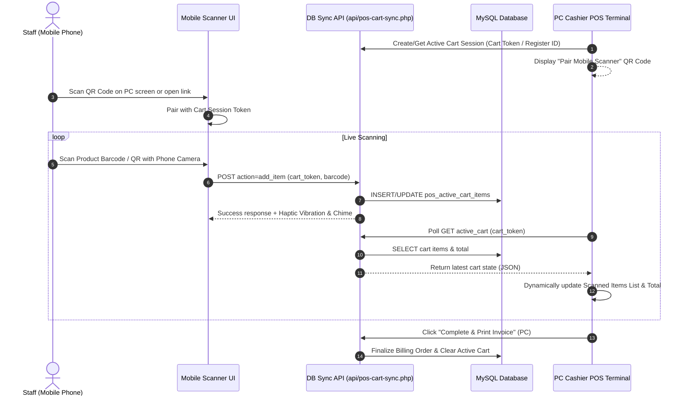
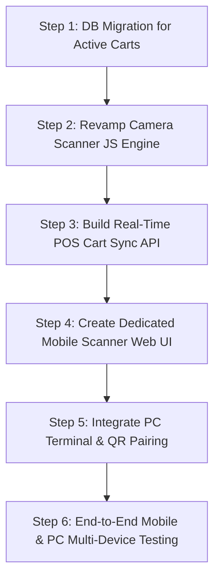

# Implementation Plan: Mobile-Friendly Camera Barcode Scanner & Real-Time DB Cart Sync

This plan details the architecture, design, database migration, API endpoints, and step-by-step roadmap to resolve mobile camera scanning issues and transition POS billing cart storage from browser `localStorage` to a synchronized **Database-Backed Active Cart System**.

---

## 1. Executive Summary & Goals

### Problem Statement
1. **Camera Scanner Issues & Mobile Responsiveness**:
   - Camera barcode scanning currently struggles on mobile devices due to camera track selection, fixed-size decoding boxes (`qrbox`), lack of responsive layout scaling, missing flashlight/torch controls, and unhandled browser media permission constraints on local HTTP/IP connections.
2. **Isolated LocalStorage Cart**:
   - Cart data currently resides in browser `localStorage`. Scans on a mobile phone do not sync to the main cashier PC terminal, making it impossible to use a smartphone as a handheld mobile scanner while operating the billing/checkout screen on a PC.

### Solution Overview
- **Mobile-First Camera Scanner Engine**: Revamp `assets/js/camera-scanner-utils.js` with responsive viewport sizing, torch/flashlight toggling, camera device switching, 1D/2D symbology filtering, and haptic/audio feedback.
- **Database-Backed Active Cart System**: Introduce `pos_active_carts` and `pos_active_cart_items` database tables.
- **PC-Mobile Session Pairing via QR Code**: PC displays a unique "Scan to Connect Mobile Scanner" QR code. Smartphone staff scan it to pair their camera to the PC's active register cart.
- **Real-Time Synchronized Checkout**: Scans on mobile instantly insert items into the DB active cart. The PC screen polls/syncs every 1 sec and displays newly added items live, allowing the cashier to complete the sale on PC.

---

## 2. Architecture & Data Flow



---

## 3. Database Schema Design

### Migration File: `database/migrations/25_create_pos_active_carts_tables.php`

```sql
-- 1. Active Cart Sessions Table
CREATE TABLE IF NOT EXISTS `pos_active_carts` (
    `id` INT AUTO_INCREMENT PRIMARY KEY,
    `cart_token` VARCHAR(64) NOT NULL UNIQUE,
    `register_session_id` INT DEFAULT NULL,
    `cashier_user_id` INT NOT NULL,
    `status` ENUM('active', 'parked', 'completed', 'abandoned') DEFAULT 'active',
    `customer_name` VARCHAR(150) DEFAULT NULL,
    `customer_phone` VARCHAR(30) DEFAULT NULL,
    `discount_amount` DECIMAL(10, 2) DEFAULT 0.00,
    `notes` TEXT DEFAULT NULL,
    `version_hash` VARCHAR(32) DEFAULT NULL,
    `created_at` TIMESTAMP DEFAULT CURRENT_TIMESTAMP,
    `updated_at` TIMESTAMP DEFAULT CURRENT_TIMESTAMP ON UPDATE CURRENT_TIMESTAMP,
    INDEX `idx_token` (`cart_token`),
    INDEX `idx_status` (`status`),
    INDEX `idx_cashier` (`cashier_user_id`)
) ENGINE=InnoDB DEFAULT CHARSET=utf8mb4 COLLATE=utf8mb4_unicode_ci;

-- 2. Active Cart Line Items Table
CREATE TABLE IF NOT EXISTS `pos_active_cart_items` (
    `id` INT AUTO_INCREMENT PRIMARY KEY,
    `cart_id` INT NOT NULL,
    `variant_id` INT DEFAULT NULL,
    `product_id` INT DEFAULT NULL,
    `product_name` VARCHAR(255) NOT NULL,
    `size` VARCHAR(100) DEFAULT NULL,
    `price` DECIMAL(10, 2) NOT NULL,
    `sell_type` ENUM('whole', 'loose') DEFAULT 'whole',
    `quantity` DECIMAL(10, 2) NOT NULL DEFAULT 1.00,
    `added_by_device` ENUM('pc', 'mobile_camera', 'manual') DEFAULT 'pc',
    `created_at` TIMESTAMP DEFAULT CURRENT_TIMESTAMP,
    `updated_at` TIMESTAMP DEFAULT CURRENT_TIMESTAMP ON UPDATE CURRENT_TIMESTAMP,
    FOREIGN KEY (`cart_id`) REFERENCES `pos_active_carts`(`id`) ON DELETE CASCADE,
    INDEX `idx_cart_variant` (`cart_id`, `variant_id`)
) ENGINE=InnoDB DEFAULT CHARSET=utf8mb4 COLLATE=utf8mb4_unicode_ci;
```

---

## 4. Component Details & Enhancements

### 4.1 Mobile Camera Scanner Engine (`assets/js/camera-scanner-utils.js`)
1. **Dynamic Responsive Viewport**: Replace static widths with percentage-based responsive calculations:
   `qrbox: (viewWidth, viewHeight) => ({ width: Math.min(viewWidth * 0.8, 300), height: Math.min(viewHeight * 0.5, 180) })`
2. **Torch / Flashlight Control**: Detect media track capability `track.getCapabilities().torch` and toggle on/off with a single button.
3. **Camera Selector**: Enumerate video inputs and default to back camera (`facingMode: { ideal: "environment" }`).
4. **Symbology & Debounce**: EAN-13, EAN-8, CODE-128, UPC-A, QR_CODE decoding with 800ms debounce to prevent duplicates.
5. **Haptic Feedback**: Trigger `navigator.vibrate([80])` on successful scan.

### 4.2 Dedicated Mobile Scanner UI (`admin/mobile-scanner.php`)
- Ultra-fast, touch-optimized page designed specifically for smartphones.
- Displays camera view, active session cart badge count, last scanned item preview, manual barcode fallback input, and item quantity controls.
- Works over Wi-Fi network on mobile browser.

### 4.3 POS Real-Time Sync API (`api/pos-cart-sync.php`)
- **JSON endpoints**:
  - `action=get_cart`: Returns JSON of active items, version hash, customer info, and totals.
  - `action=add_item`: Adds product by barcode or variant ID.
  - `action=update_qty`: Modifies line item quantity or sell type.
  - `action=remove_item`: Deletes line item.
  - `action=clear_cart`: Clears active cart.
  - `action=sync_checkout`: Processes final invoice creation and clears DB cart.

### 4.4 PC Terminal POS Interface (`admin/barcode-billing.php`)
- Add **"📱 Pair Mobile Scanner"** modal with QR code generation (using `qrious` or `qrcode.js` or Google Charts API).
- Short polling mechanism (`setInterval`, 1000ms) comparing `version_hash` to avoid heavy server payload when cart hasn't changed.
- Smooth CSS animations for newly added items from mobile scanner.
- Maintains `localStorage` as an offline cache backup.

---

## 5. Step-by-Step Implementation Roadmap



### Step 1: Migration Script
- Create `database/migrations/25_create_pos_active_carts_tables.php`.
- Run migration via `admin/migrations.php`.

### Step 2: Refactor `assets/js/camera-scanner-utils.js`
- Implement dynamic aspect-ratio container scaling.
- Add camera track torch toggle and multi-lens camera switcher.
- Implement mobile touch reticle and haptic feedback.

### Step 3: Develop `api/pos-cart-sync.php`
- Handle session security and session tokens.
- Write atomic cart updates in DB with `version_hash` calculations.

### Step 4: Develop `admin/mobile-scanner.php`
- Standalone mobile-friendly barcode/QR scanner web page.
- Direct integration with DB cart API.

### Step 5: Update `admin/barcode-billing.php` & `admin/billing.php`
- Connect active cart rendering to DB sync API instead of `localStorage`-only.
- Add QR Code popup modal for pairing mobile device.

### Step 6: Testing & Verification
- Test mobile camera barcode scanning across Safari iOS & Chrome Android.
- Verify real-time cart synchronization between mobile phone scan and PC billing screen.
- Verify offline/reconnection resiliency and checkout bill printing.

---

## 6. Action Requested

Please review this plan. Once approved, implementation can begin immediately.
